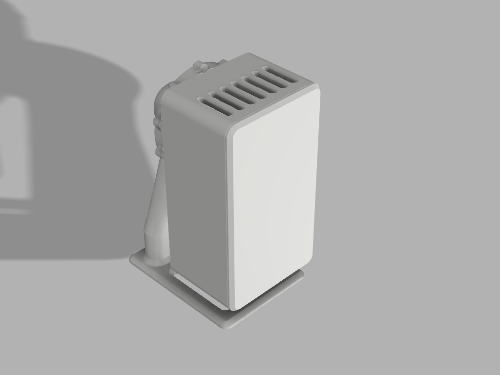

# Info

# Hardware
- [Seeed Studio XIAO ESP32C3](https://wiki.seeedstudio.com/XIAO_ESP32C3_Getting_Started/)
- [HLK-LD2450 MM](https://de.aliexpress.com/item/1005006121923099.html?spm=a2g0o.order_detail.order_detail_item.3.4fd66368KUy7w8&gatewayAdapt=glo2deu)

**_NOTE:_** Connect RX/TX/GND and 5V

# Case

